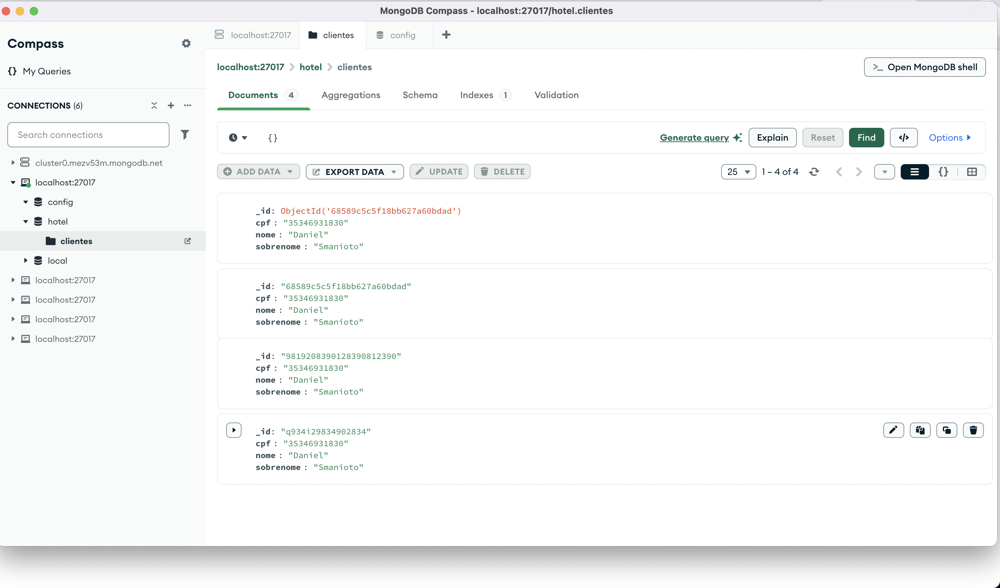
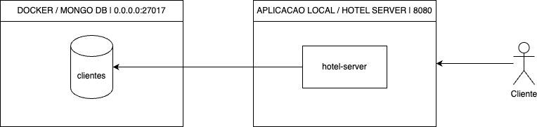
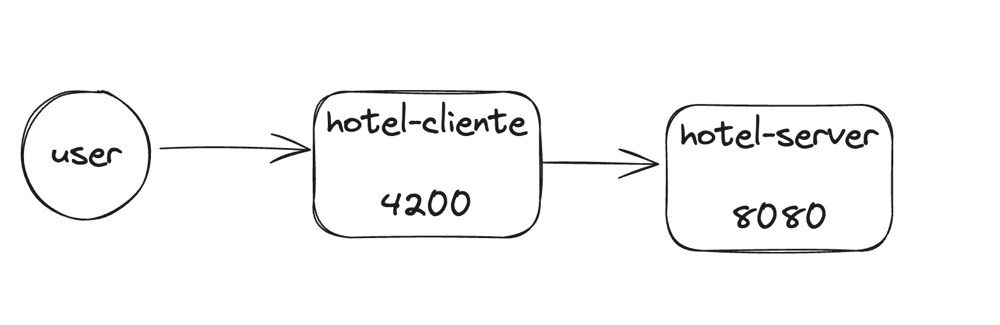

# hotel-server

aplicacao hotel-server é responsavel por ser a api do sistemsa de hotel.
sistema de hotel é uma aplicacao client server.

# rotas 
- reservas
- reservar
- acomodacoes
- clientes
- clientes_com_reservas-ativas

# requisitos tecnicos
- rotas localmente no docker via containers 
- banco de dados nosql mongo db (devido estudos e poder de escala)
- esteira de ci/cd github actions deve executar os teses quando push na main
 
# modelagem de dados

- acomodacoes (id, tipo, valor diaria,, numero_quarto) 
- reservas ( id, numero_quarto, data_reservada, data_cadastro, status, id_cliente)
-  clientes ( id, cpf, nome, sobrenome)
 
# run wiremock / testes para rotas virtualizadas
`docker run -it --rm -p 8080:8080 \
-v $(pwd)/mocks:/home/wiremock \
wiremock/wiremock:3.3.1`

# rotas 
- `curl http://localhost:8080/clientes`
- `curl http://localhost:8080/acomodacoes`
- `curl http://localhost:8080/clientes_com_reservas-ativas`
- `curl http://localhost:8080/reservas` 
- `curl -X POST http://localhost:8080/reservas \
  -H "Content-Type: application/json" \
  -d '{
  "numero_quarto": 101,
  "data_reservada": "2024-06-10",
  "id_cliente": 1
  }'`

# Build Java app with spring 

1. `cd infra && docker compose up`
2. garantir que o banco de dados esteja ceiado com banco de dados hotel e colecoes clientes 
3. ter alguns dados conforme docs/examples 
4. `./gradlew clean build` 
5. `./gradlew bootRun --args='--server.port=8080'`

# Visao do banco de dados mongo db 

# desenho de solucao

# Overview da aplicacao 
