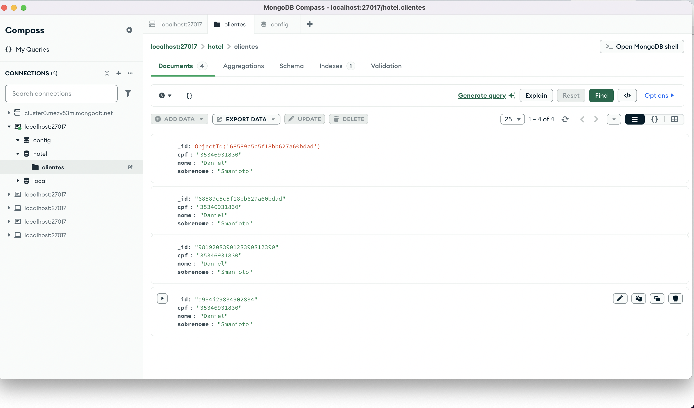
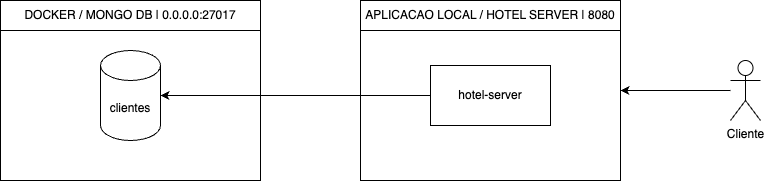

# Hotel Server

<div align="center">


API REST desenvolvida com Spring Boot para o sistema de gestão de hotel, com persistência em MongoDB e suporte a mocks locais via WireMock para cenários de integração e estudo.

</div>

## Sumário

- [Visão geral](#visão-geral)
- [Stack utilizada](#stack-utilizada)
- [Arquitetura do projeto](#arquitetura-do-projeto)
- [Funcionalidades atuais](#funcionalidades-atuais)
- [Endpoints](#endpoints)
- [Como executar localmente](#como-executar-localmente)
- [Mocks com WireMock](#mocks-com-wiremock)
- [Modelagem de dados](#modelagem-de-dados)
- [Testes](#testes)
- [Documentação visual](#documentação-visual)

## Visão geral

O `hotel-server` representa o backend de uma aplicação client-server para gestão hoteleira. O projeto foi estruturado para expor uma API HTTP, integrar com MongoDB e permitir simulações de serviços/rotas por meio de mocks locais.

Atualmente, a aplicação já possui implementação real para cadastro e listagem de clientes, além de artefatos de apoio para cenários virtualizados envolvendo acomodações e reservas.

## Stack utilizada

- **Linguagem:** Java 20
- **Framework:** Spring Boot 3.5.0
- **Build tool:** Gradle
- **Banco de dados:** MongoDB
- **Testes:** JUnit 5 + Spring Test + Mockito
- **Virtualização de APIs:** WireMock
- **Container local:** Docker Compose

## Arquitetura do projeto

O projeto segue uma organização em camadas, facilitando manutenção e evolução:

- **`controller`**: expõe os endpoints HTTP
- **`service`**: concentra regras de negócio
- **`repository`**: abstrai a persistência no MongoDB
- **`model`**: define as entidades do domínio
- **`config`**: configurações da aplicação, como CORS

## Funcionalidades atuais

- Cadastro de clientes
- Listagem de clientes
- Persistência de dados em MongoDB
- Ambiente local com MongoDB via Docker Compose
- Rotas mockadas para cenários de integração e experimentação

## Endpoints

### API implementada no Spring Boot

Base URL padrão: `http://localhost:8080`

| Método | Rota | Descrição |
|---|---|---|
| `GET` | `/clientes` | Lista todos os clientes cadastrados |
| `POST` | `/clientes` | Cria um novo cliente |

### Exemplo de requisições

**Listar clientes**

```bash
curl http://localhost:8080/clientes
```

**Criar cliente**

```bash
curl -X POST http://localhost:8080/clientes \
  -H "Content-Type: application/json" \
  -d '{
    "cpf": "12345678900",
    "nome": "João",
    "sobrenome": "Silva"
  }'
```

## Como executar localmente

### 1. Subir o MongoDB

```bash
cd infra
docker compose up -d
```

O banco será disponibilizado em `localhost:27017`, utilizando a base `hotel`.

### 2. Executar a aplicação

Na raiz do projeto:

```bash
./gradlew clean build
./gradlew bootRun --args='--server.port=8080'
```

### 3. Configuração atual da aplicação

As propriedades principais estão definidas em `src/main/resources/application.properties`:

- `spring.data.mongodb.host=localhost`
- `spring.data.mongodb.port=27017`
- `spring.data.mongodb.database=hotel`

## Mocks com WireMock

O projeto também possui arquivos de mock em `mocks/` para rotas virtualizadas úteis em estudos, testes locais e prototipação.

### Subir o WireMock

```bash
docker run -it --rm -p 8081:8080 \
  -v $(pwd)/mocks:/home/wiremock \
  wiremock/wiremock:3.3.1
```

### Rotas mockadas disponíveis

Base URL do WireMock: `http://localhost:8081`

- `GET /clientes`
- `GET /acomodacoes`
- `GET /clientes_com_reservas-ativas`
- `GET /reservas`
- `POST /reservas`

### Exemplo de uso do mock de reservas

```bash
curl -X POST http://localhost:8081/reservas \
  -H "Content-Type: application/json" \
  -d '{
    "numero_quarto": 101,
    "data_reservada": "2024-06-10",
    "id_cliente": 1
  }'
```

## Modelagem de dados

### Coleção `clientes`

- `id`
- `cpf`
- `nome`
- `sobrenome`

### Estruturas previstas para evolução do domínio

- **acomodacoes**: `id`, `tipo`, `valor_diaria`, `numero_quarto`
- **reservas**: `id`, `numero_quarto`, `data_reservada`, `data_cadastro`, `status`, `id_cliente`

## Testes

Para executar os testes automatizados:

```bash
./gradlew test
```

O projeto já possui testes cobrindo o controller de clientes e o contexto principal da aplicação.

## Documentação visual

### Visão do banco MongoDB



### Desenho da solução



### Overview da aplicação


## Próximos passos sugeridos

- Expandir os endpoints reais de acomodações e reservas
- Adicionar validações de entrada com Bean Validation
- Versionar a API
- Configurar pipeline CI/CD com GitHub Actions
- Publicar documentação OpenAPI/Swagger